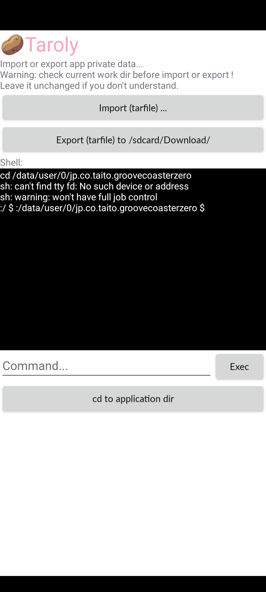

# 🥔Taroly plugin manager for Groove Coaster 2 Android

> PLEASE READ THIS FILE. Disclaimer: this repo does NOT contain any proprietary code from the game.

plugins and compiled apks: [download from 🥔cloud](https://cloud.leohearts.com/s/JyAitgJ7dZ5N5Zr)

* `out_1.02.apk` # Groove Coaster apk file with 🥔Taroly injected only, and no copyright violating file included. (Now you don't need to worry about it because the official server is shutting down.)
* `groove-choose-backup-server.tar` # to change to a community backup mirror after the official server shuts down.
* `groove_boot.tar` # resource files for first start, useful when you stuck on "Downloading / Connecting"
* `groove_fullsong_res.tar` # resource files for songs, useful when you are offline (e.g in a ✈️) but need to play songs for the first time.

  ⚠️This file may take \~5 min ~~with ui freeze~~(fixed in 1.01) to import.

## How to use

1. Install apk
2. long press app icon, select "Taroly"
3. Click "Import"
4. Select downloaded plugin .tar files

## If you are here after the server shut down:

0. ensure you can enter the game. if you are stuck at "DOWNLOADING" screen *before* going to the song selection screen, import `groove_boot.tar` (which also includes a `save.bin`). also make sure you have obbs installed! you'll need to allow `install unknown apps` and `all files` permission for this app to automatically deploy obbs.

1. import `groove-choose-backup-server.tar` for *online* play on a 3rd-party server

    **<or>**

    import `groove_fullsong_res.tar` for *offline* play, in the case you don't have internet or prefer not using a server

2. you are done

## Build from source

1. download v1.0.17 from [uptodown](https://groove-coaster-2.en.uptodown.com/android/download/1098447892)
2. `apktool d groove-coaster-2-1-0-17-uptodown.apk`
3. download this repo and apply `taroly.patch` to apktool out dir
4. `apktool b groove-coaster-2-1-0-17-uptodown-patched`
5. sign and install `./dist/out*.apk`

## See also

- https://github.com/qwerfd2/Groove_Coaster_2_Server

## Security & Privacy

~~Feel free to decompile this apk 😎 (Code in `leph1.codeInject`) with jadx~~

now fully open source. yes, i wrote this (partially)with smali, so no java code.

## Screenshots

## Changelog

### Update 1.01

* Improve performance.
* Fix crash on some newer devices.

Unsolved:

* Press (back) if it didn't request permission on first start.

### Update 1.02

- No additional permission issue now. Install, click, play.
- changed obb installation method, so we can change to backup mirrors after this game got no longer supported. Just import `groove-choose-backup-server.tar` in 🥔Taroly, and all songs could be downloaded as you play from our backup mirror source. You can also use `groove_fullsong_res.tar` if you just want to play offline.
- Old resource tar and boot tar files are still supported.

